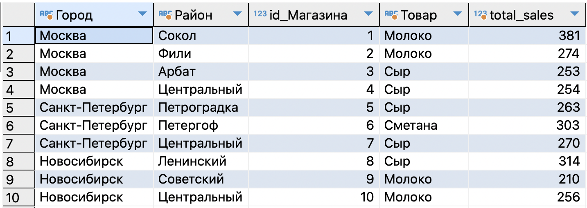
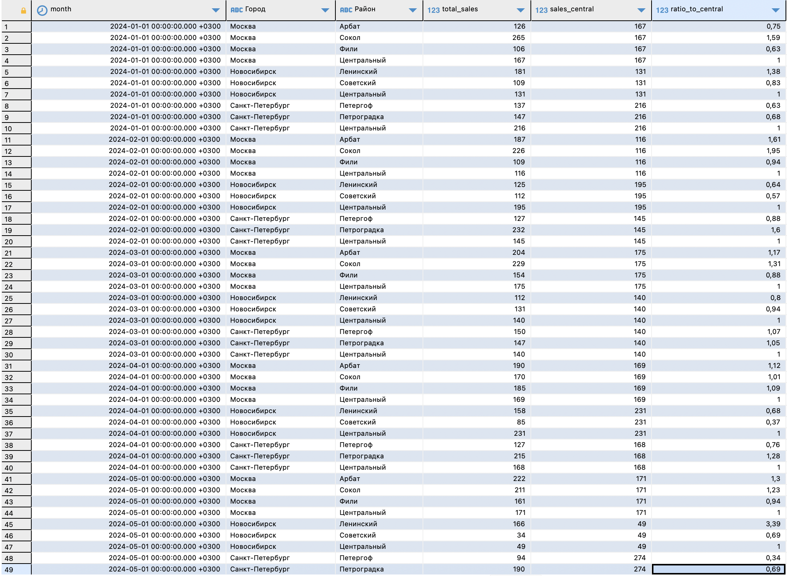
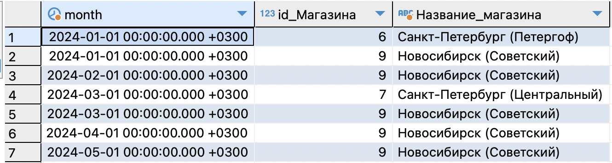
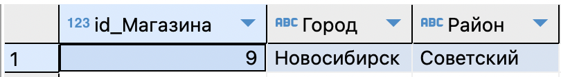
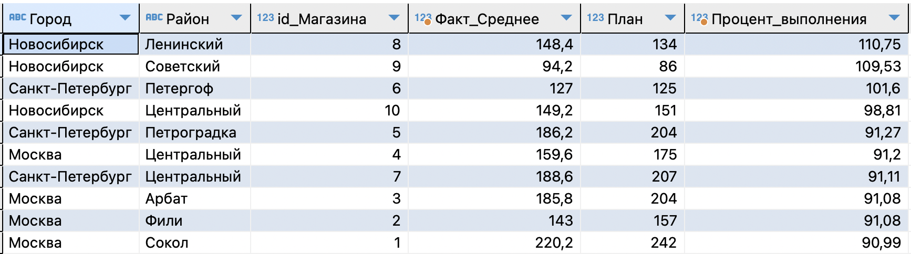

# 🚀 Решение тестового задания (Технический блок)

## 📊 Блок А: SQL (PostgreSQL)

### 📝 Запрос 1: Топ-товары с максимальными продажами для каждого магазина (с начала года)
Логика решения:
Так как в таблице фактов чеки (продажи) разбиты по дням, нам сначала нужно просуммировать продажи каждого товара внутри каждого магазина. Затем мы используем оконную функцию RANK(), чтобы присвоить товарам места с 1-го и ниже в зависимости от объема продаж. В конце оставляем только те строки, где ранг равен 1.

Примечание: Так как наши тестовые данные за 2024 год, я жестко указал в фильтре WHERE Date >= '2024-01-01'. В рабочей базе вместо этого используют динамическую функцию date_trunc('year', CURRENT_DATE).

```sql
WITH SalesPerProduct AS (
    -- 1. Считаем общие продажи каждого товара в каждом магазине с начала года
    SELECT 
        id_Магазина, 
        id_Товара, 
        SUM(Value) as total_sales
    FROM test_Fact
    WHERE Date >= '2024-01-01'
    GROUP BY id_Магазина, id_Товара
),
RankedSales AS (
    -- 2. Ранжируем товары внутри каждого магазина (PARTITION BY) по убыванию продаж (DESC)
    SELECT 
        id_Магазина,
        id_Товара,
        total_sales,
        RANK() OVER(PARTITION BY id_Магазина ORDER BY total_sales DESC) as rnk
    FROM SalesPerProduct
)
-- 3. Соединяем со справочниками для красоты и фильтруем только лидеров (rnk = 1)
SELECT 
    c.Город,
    c.Район,
    r.id_Магазина, 
    p.Товар, 
    r.total_sales
FROM RankedSales r
JOIN test_dim_Cust c ON r.id_Магазина = c.id_Магазина
JOIN test_dim_Prod p ON r.id_Товара = p.id_Товара
WHERE r.rnk = 1
ORDER BY r.id_Магазина;
```


### 📝 Запрос 2. Отношение продаж района к району "Центральный" (по месяцам и городам)
Логика решения:

Для решения этой задачи лучше всего использовать обобщенные табличные выражения (CTE). Сначала мы агрегируем продажи до уровня «Месяц — Город — Район», затем выделим продажи эталонного района («Центральный») и в финальном шаге рассчитаем коэффициент.

Использование NULLIF в знаменателе — важный нюанс для корпоративной аналитики, так как он страхует запрос от ошибки деления на ноль, если в каком-то месяце в центральном районе не было продаж.

```sql
WITH MonthlyDistrictSales AS (
    -- Агрегируем продажи по месяцам, городам и районам
    SELECT 
        DATE_TRUNC('month', f.Date) as month,
        c.Город,
        c.Район,
        SUM(f.Value) as total_sales
    FROM test_Fact f
    JOIN test_dim_Cust c ON f.id_Магазина = c.id_Магазина
    GROUP BY 1, 2, 3
),
CentralSales AS (
    -- Выделяем продажи только района "Центральный" как базу для сравнения
    SELECT 
        month,
        Город,
        total_sales as central_val
    FROM MonthlyDistrictSales
    WHERE Район = 'Центральный'
)
-- Джойним общие продажи с эталонными и считаем отношение
SELECT 
    m.month,
    m.Город,
    m.Район,
    m.total_sales,
    c.central_val as sales_central,
    ROUND(m.total_sales::numeric / NULLIF(c.central_val, 0), 2) as ratio_to_central
FROM MonthlyDistrictSales m
JOIN CentralSales c 
  ON m.month = c.month 
  AND m.Город = c.Город
ORDER BY 1, 2, 3;
```



### 📝 Запрос 3. По месяцам магазины в которых не было продаж "Йогурта" ( id_Товара = 4 )
Логика решения
Чтобы найти магазины, которые работали в конкретном месяце (то есть у них были хоть какие-то продажи), но при этом они не продали ни одного йогурта, элегантнее всего использовать группировку GROUP BY с фильтрацией через HAVING.

Мы собираем все чеки магазина за месяц и с помощью условной агрегации SUM(CASE ...) проверяем: если сумма строчек, где id_Товара = 4, равна нулю, значит, йогурт в этом месяце в этом магазине не пробивался. Важный нюанс: этот подход исключает "закрытые" магазины (те, у которых вообще не было никаких продаж в рассматриваемом месяце), что защищает нас от ложных срабатываний (отсутствие продаж йогурта из-за того, что магазин не работал).

```sql
SELECT 
    DATE_TRUNC('month', f.Date) as month,
    f.id_Магазина,
    c.Город || ' (' || c.Район || ')' as Название_магазина
FROM test_Fact f
JOIN test_dim_Cust c ON f.id_Магазина = c.id_Магазина
GROUP BY 
    1, 2, 3
HAVING 
    SUM(CASE WHEN f.id_Товара = 4 THEN 1 ELSE 0 END) = 0
ORDER BY 
    1, 2;
```


### 📝 Запрос 4. Магазины в которых никогда не продавался "Йогурт" ( id_Товара = 4 )

Логика решения
В отличие от предыдущего запроса, здесь нам нужен глобальный поиск по всей базе, независимо от месяца. Если магазин продал йогурт в январе, но не продавал в феврале — он нам не подходит. Нам нужны те, кто игнорирует эту категорию абсолютно всё время.

Самый читаемый и надежный способ для такой задачи — использовать логическое исключение (NOT IN).

    Сначала мы пишем подзапрос, который собирает уникальные ID всех магазинов, где товар №4 фигурировал в чеках хотя бы один раз за всю историю.

    Затем мы берем полный справочник всех наших магазинов (test_dim_Cust) и просим вывести только те, чьего ID нет в списке из первого шага.

```sql
SELECT 
    id_Магазина,
    Город,
    Район
FROM test_dim_Cust
WHERE id_Магазина NOT IN (
    -- Подзапрос: список магазинов, продавших йогурт хотя бы раз
    SELECT DISTINCT id_Магазина
    FROM test_Fact
    WHERE id_Товара = 4
)
ORDER BY 
    id_Магазина;
```


### 📝 Запрос 5. Сравнить средние продажи по магазинам с начала года с планами. (учесть: в магазинах много разных товаров)

Логика решения

Если мы просто сделаем AVG(Value) по таблице фактов, мы получим среднее количество одного проданного товара в чеке (условно 40–50 штук), а план у нас установлен на общие продажи магазина за период (условно 150–250 штук).

Поэтому расчет должен быть двухступенчатым:

    Вложенный запрос (CTE 1): Сначала собираем общую сумму продаж (SUM) всех товаров для каждого магазина в рамках каждого периода (в наших данных это срез по датам/месяцам).

    Вложенный запрос (CTE 2): Вычисляем среднее значение (AVG) уже от этих агрегированных ежемесячных сумм.

    Финальный SELECT: Соединяем факт со справочником магазинов и таблицей планов, чтобы посчитать процент выполнения плана.

```sql
WITH StorePeriodicSales AS (
    -- Шаг 1: Суммируем продажи всех товаров по каждому магазину за каждую дату (период)
    SELECT 
        id_Магазина, 
        Date, 
        SUM(Value) as periodic_total
    FROM test_Fact
    WHERE Date >= '2024-01-01'
    GROUP BY 
        id_Магазина, 
        Date
),
AverageStoreSales AS (
    -- Шаг 2: Считаем среднее арифметическое от общих сумм периодов
    SELECT 
        id_Магазина, 
        ROUND(AVG(periodic_total), 2) as avg_fact
    FROM StorePeriodicSales
    GROUP BY 
        id_Магазина
)
-- Шаг 3: Сравниваем средний факт с планом и считаем процент выполнения
SELECT 
    c.Город,
    c.Район,
    a.id_Магазина,
    a.avg_fact as Факт_Среднее,
    p.Value as План,
    ROUND((a.avg_fact / NULLIF(p.Value, 0)) * 100, 2) as Процент_выполнения
FROM AverageStoreSales a
JOIN test_dim_Cust c ON a.id_Магазина = c.id_Магазина
JOIN test_Plan p ON a.id_Магазина = p.id_Магазина
ORDER BY 
    Процент_выполнения DESC;
```


## 📈 Блок Б: DAX (Power BI)

*Базовая мера:* 
Создаем базовую меру для переиспользования во всех остальных расчетах.

```dax
[Сумма Продаж] = SUM('Fact'[Value])
```

### 💡 Процентное отношение продаж к прошлому месяцу.
Используем Time Intelligence. DATEADD сдвигает контекст фильтра на один месяц назад. Функция DIVIDE безопасно делит текущий факт на прошлый (избегая ошибки деления на ноль).

```dax
[Отношение к прошлому месяцу %] = 
VAR CurrentSales = [Сумма Продаж]
VAR LastMonthSales = CALCULATE([Сумма Продаж], DATEADD('Calendar'[Date], -1, MONTH))
RETURN DIVIDE(CurrentSales, LastMonthSales)
```

### 💡 Доля продаж по месяцам каждого магазина внутри данной выборки (сумма по всем магазинам).
Логика решения
Чтобы посчитать долю, нам нужно разделить продажи конкретного магазина на общие продажи всех магазинов в этом же месяце. Функция ALL('dim_Cust') снимает фильтр с конкретного магазина, но оставляет фильтр по дате (месяцу), что дает нам правильный знаменатель.

```dax
[Доля магазина в месяце] = 
VAR StoreSales = [Сумма Продаж]
VAR TotalSalesInMonth = CALCULATE([Сумма Продаж], ALL('dim_Cust'))
RETURN DIVIDE(StoreSales, TotalSalesInMonth)
```

### 💡 Накопительные продажи с начала года товара "Молоко" (id_Товара = 1).
Логика решения
Задача требует вычисления нарастающего итога (Year-To-Date или YTD) с одновременным применением жесткого фильтра по конкретному товару.

В DAX для этого используется изменение контекста фильтра с помощью функции CALCULATE. Логика работает в два шага:

    Накопление времени: Вместо того чтобы считать продажи только за один конкретный месяц, мы используем функцию DATESYTD('Calendar'[Date]). Это создает эффект снежного кома (накопления).

    Фильтрация товара: Вторым аргументом внутри CALCULATE мы накладываем строгое логическое условие 'dim_Prod'[id_Товара] = 1. Это отсекает из расчета все сыры, йогурты и сметану, оставляя только нужный продукт.

```dax
[Продажи Молоко YTD] = 
CALCULATE(
    [Сумма Продаж],
    DATESYTD('Calendar'[Date]),
    'dim_Prod'[id_Товара] = 1
)

```

### 💡 Средние продажи по магазинам за последние три месяца. (учесть: в магазинах много разных товаров)
Если использовать просто AVERAGE, мера посчитает среднюю строку в чеке. Использование итератора AVERAGEX в связке с VALUES('dim_Cust'[id_Магазина]) заставляет Power BI сначала посчитать сумму для каждого магазина, а потом найти среднее среди этих сумм. DATESINPERIOD задает окно в 3 месяца от максимальной выбранной даты.

```dax
[Средние продажи за 3 мес] = 
CALCULATE(
    AVERAGEX(
        VALUES('dim_Cust'[id_Магазина]),
        [Сумма Продаж]
    ),
    DATESINPERIOD('Calendar'[Date], MAX('Calendar'[Date]), -3, MONTH)
)
```

### 💡 Выполнение плана продаж каждого магазина: Процентное отношение средних продаж по магазинам за последние три месяца к планам.
Логика решения
Сначала мы агрегируем плановое значение (если таблица планов связана с таблицей магазинов связью 1-ко-многим или 1-к-1). Затем просто делим результат предыдущей меры (Средние продажи за 3 мес) на этот План.

```dax
[Сумма Плана] = SUM('Plan'[Value])

[Выполнение плана %] = 
DIVIDE([Средние продажи за 3 мес], [Сумма Плана])
```
